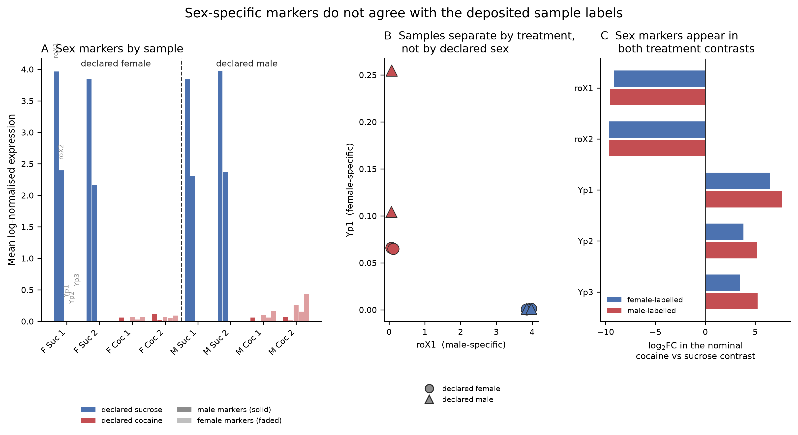

# Reanalysis of the cocaine-exposed *Drosophila* brain (GSE152495)

### The atlas reproduces. The sample labels do not agree with the data.

Independent Scanpy-based reanalysis of the single-cell transcriptomic atlas
published by **Baker et al. (2021)**, *Genome Research* 31:1927–1937
([doi:10.1101/gr.268037.120](https://doi.org/10.1101/gr.268037.120)).

Quality filtering recovers **86,177 cells against the 86,224 reported** — a
difference of 0.05% — and the clustering recovers the major neuronal and glial
populations. But sex-specific marker genes in the deposited data do not agree
with the deposited sex labels, and the consequence is that **neither treatment
contrast can be separated from a sex contrast**.

> **Status: the labelling discrepancy is unresolved and has been referred to the
> original authors.** Until it is resolved, no differential expression result
> from this dataset — in this repository or in the original publication — should
> be interpreted as a cocaine effect. Full detail in
> [`docs/data_provenance.md`](docs/data_provenance.md).

📄 **[Full report (PDF)](reports/)** · 🧬
**[Data: GEO GSE152495](https://www.ncbi.nlm.nih.gov/geo/query/acc.cgi?acc=GSE152495)**

---


---

## The finding

Three sex-specific markers separate the eight samples cleanly — but the split
follows the **treatment** field of the sample name, not the **sex** field.
Ranges across the four samples in each group; none overlap:

| Marker | Specificity | 4 Sucrose samples | 4 Cocaine samples |
|---|---|---|---|
| `roX1` | male (dosage compensation) | 3.846 – 3.972 | 0.059 – 0.116 |
| `roX2` | male (dosage compensation) | 2.160 – 2.396 | 0.008 – 0.015 |
| `Yp1` | female (yolk protein) | 0.000 – 0.001 | 0.065 – 0.255 |
| `Yp3` | female (yolk protein) | 0.006 – 0.010 | 0.069 – 0.428 |
| `Sxl` | female | 0.695 – 0.984 | 1.227 – 1.762 |

Yolk proteins are not transcribed in males. The highest value in the dataset
(`Yp3` = 0.428) is in a sample labelled male.

Genes regulated post-transcriptionally and present in both sexes at the RNA level
— `msl-2`, `mle`, `tra` — show no such separation, as expected. Only the
genuinely sex-specific transcripts split the samples.

**The consequence.** Comparing cocaine with sucrose within each declared sex
returns the sex markers among the most significant genes in *both* comparisons:
`roX1` and `roX2` at approximately −9.5 log₂FC with adjusted *p* below machine
precision, and `Yp1` at +7.7 in the male-labelled contrast.



### Sample identity was verified three ways

All three agree, so the discrepancy did not arise during analysis or deposition:

1. **Supplemental Table S2 cell counts** match all eight deposited matrices
   exactly (9,072 / 11,693 / 13,193 / 11,033 / 13,072 / 9,367 / 10,437 / 11,124;
   total 88,991). Cell count is intrinsic to each file.
2. **GEO sample titles** correspond to the same assignment.
3. **The authors' Supplemental Code** documents the same mapping from CellRanger
   output directories (S1–S8v2) through to the Seurat objects.

Neither the original analysis nor this one, as first written, checked sex markers
against the declared labels. The check takes one line of code.

---

## What reproduces

| Published | This reanalysis |
|---|---|
| 86,224 cells after QC | **86,177** — 0.05% difference |
| 36 clusters at resolution 0.8 | **30**; reaches 36 at ~1.33 |
| Cluster count plateaus at 0.8 | **Not reproduced** — monotonic increase |
| All major cell types represented | 24 of 30 clusters assigned |
| No batch effect | 1 of 30 clusters >30% from one sample |

Clustering and annotation do not depend on sample labels and are unaffected by
the discrepancy above.

---

## Three data problems found before analysis

Each would have propagated silently:

1. **`features.tsv.gz` was space- rather than tab-delimited**, so
   `scanpy.read_10x_mtx` could not assign gene symbols.
2. **The gene *nanchung* (`nan`, Dmel_CG5842) is parsed by pandas as a missing
   value**, leaving one gene unnamed and blocking HDF5 serialisation.
3. **Five fly symbols are replaced by vertebrate ortholog names** in the
   reference: `VGlut1`, `Adcy1`, `Pde4`, `Trhn`, `Tret1`.

⚠️ **`trh` lowercase in this reference is Dmel_CG42865, *trachealess*** — a
tracheal transcription factor, not tryptophan hydroxylase. A case-insensitive
marker match would label a cluster serotonergic on the strength of a tracheal
gene.

---

## Analysis workflow


---

## Statistical controls

Applied to the differential expression results. They characterise the data, but
inherit the interpretive limitation above.

| Script | Question | Result |
|---|---|---|
| `05b` | Do cell-level results hold at replicate level? | 100% direction agreement, ρ = 0.94 / 0.96 |
| `07` | Does any gene respond *differently* by sex? | 0 genes at FDR < 0.05 (4 residual df) |
| `08B` | Is the response ranking power or biology? | ρ = 0.63 size vs DE count; ranking shifts |
| `10` | Is the effect larger than its own background? | Male 90 vs 16/44; female 152 vs 19/33 |

---

## Data

| | |
|---|---|
| **Accession** | [GSE152495](https://www.ncbi.nlm.nih.gov/geo/query/acc.cgi?acc=GSE152495) |
| **Raw archive** | [GSE152495_RAW.tar](https://ftp.ncbi.nlm.nih.gov/geo/series/GSE152nnn/GSE152495/suppl/GSE152495_RAW.tar) |
| **Publication** | [doi:10.1101/gr.268037.120](https://doi.org/10.1101/gr.268037.120) |
| **Design** | 8 samples · sex (F/M) × treatment (cocaine/sucrose) × 2 replicates |
| **Platform** | 10x Genomics Chromium, CellRanger v3.1, *D. melanogaster* Release 6 |

Count matrices are **not redistributed here**. Rebuild `data/` with:

```bash
bash tools/download_data.sh      # fetches and unpacks GSE152495_RAW.tar
# fill in tools/sample_map.tsv (see its header), then
bash tools/organize_data.sh
```

---

## Reproducing this analysis

```bash
uv venv --python 3.11 && source .venv/bin/activate
uv pip install -r requirements.txt
python tools/check_environment.py

python scripts/01_load_data.py
python scripts/02_qc_filter.py
python scripts/03_normalize_cluster.py
python scripts/04_annotate_clusters.py   # fill the worksheet, then re-run
python scripts/05_de_analysis.py

# controls
python scripts/05b_pseudobulk_check.py
python scripts/06_pathway_enrichment.py
python scripts/07_interaction_test.py
python scripts/08_sensitivity.py
python scripts/09_reproduce_fig3.py
python scripts/10_permutation_control.py

# the labelling check
python tools/make_sexmarker_figure.py
```

Every stage writes an `.h5ad` checkpoint. All stochastic steps use a fixed seed.
Setup instructions, including the WSL2 memory configuration needed on a 16 GB
machine, are in [`docs/SETUP.md`](docs/SETUP.md).

---

## Repository layout

    data/          8 CellRanger sample folders       [not tracked]
    docs/          provenance, setup guide, reference PDFs
    notebooks/     the pipeline as JupyterLab notebooks
    peer_review/   review checklist and rebuttal templates
    reports/       current draft; superseded outputs marked SUPERSEDED_
    results/       figures (+ supplementary/), tables, checkpoints
    scripts/       config.py + numbered pipeline (01-10)
    tools/         data download, verification, figure generation

`scripts/config.py` holds every analysis parameter with the reasoning for each.

---

## Note on an earlier version of this analysis

An earlier version concluded that the folder labels were scrambled and applied a
reassignment inferred from the deposition order in the authors' published code.
Supplemental Table S2 showed that reassignment to be wrong — the per-sample cell
counts match the folders as supplied — and it was reverted.

The history is preserved. Outputs from the earlier analysis are marked
`SUPERSEDED_` in `reports/`, the previous configuration is at
`scripts/config.py.pre-revert`, and §5 of
[`docs/data_provenance.md`](docs/data_provenance.md) records what changed and
why.

---

## Limitations

- **Treatment labels are inferred from metadata**, not verifiable from the data.
- **Two null contrasts per sex** is all four samples allow — an
  order-of-magnitude comparison, not a *p*-value.
- **The discrepancy is unresolved.** Two explanations are consistent with the
  evidence and cannot be distinguished from the deposited data.
- **Six clusters (15.7% of cells) are unannotated.**
- **One cluster was excluded post hoc** after its depth imbalance was observed.

---

## Citation

> Baker BM, Mokashi SS, Shankar V, Hatfield JS, Hannah RC, Mackay TFC, Anholt
> RRH. 2021. The *Drosophila* brain on cocaine at single-cell resolution.
> *Genome Research* 31: 1927–1937. doi:10.1101/gr.268037.120

## Acknowledgement

Self-directed reanalysis project. AI assistance is documented in
[`reports/AI_USAGE_DISCLOSURE.md`](reports/AI_USAGE_DISCLOSURE.md).
