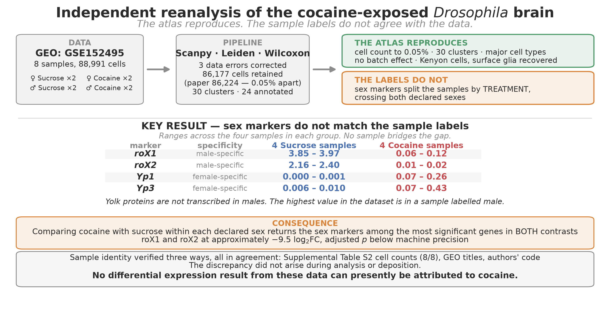
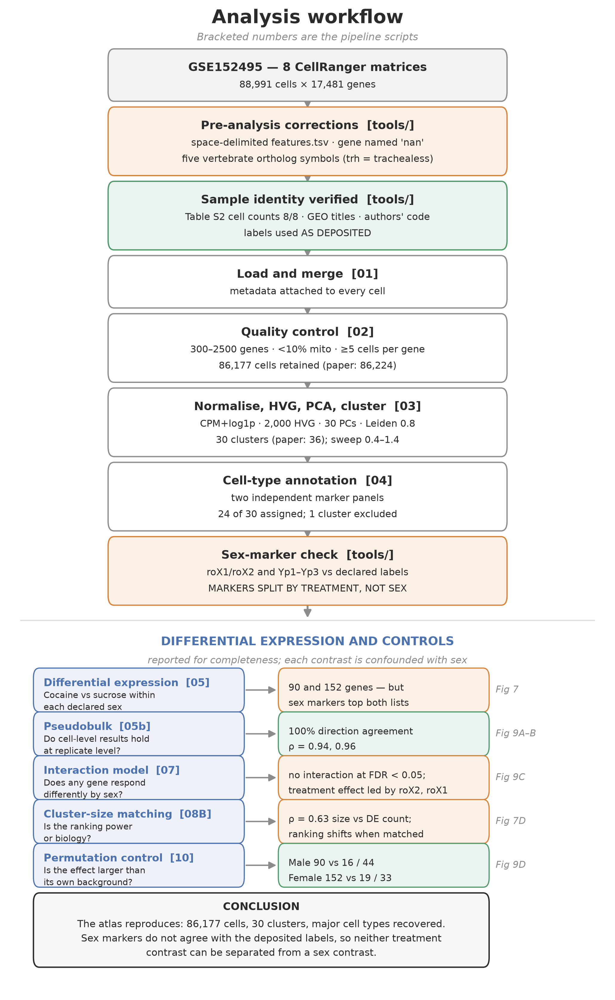

# Reanalysis of the cocaine-exposed *Drosophila* brain

### Do the published findings survive statistical controls the original analysis did not report?

**In one sentence:** a published single-cell atlas reports that cocaine produces
691 differentially expressed genes in male fly brains and 322 in females — but
when the same female samples are regrouped incorrectly, they yield *more*
differentially expressed genes than the correct grouping does.

This repository contains an independent reanalysis of **GSE152495**
([Baker et al. 2021](https://doi.org/10.1101/gr.268037.120), *Genome Research*
31:1927-1937), built from the deposited data using a different pipeline
(Scanpy/Leiden/Wilcoxon rather than Seurat/SNN/MAST). It has two aims: to test
which findings **reproduce**, and to test which **survive verification**.

The cell count reproduces to within 0.05%. The reported sexual dimorphism does
not survive a comparison against its own background.

📄 **[Full report (PDF)](reports/Drosophila_cocaine_reanalysis_report.pdf)** —
31 pages, 20 figures, 5 tables · 🧬
**[Data: GEO GSE152495](https://www.ncbi.nlm.nih.gov/geo/query/acc.cgi?acc=GSE152495)**

---



---

## Summary of findings

| Published finding | This reanalysis |
|---|---|
| 86,224 cells after QC | **86,177** — 0.05% difference |
| 36 clusters at resolution 0.8 | **30**; reaches 36 at ~1.33 |
| Cluster count plateaus at 0.8 | **Not reproduced** — monotonic increase |
| Kenyon cells among top responders | 1st raw, **7th at matched power** |
| Male-biased response, 2.15x | **0.97x to 6.43x** depending on the metric |
| Female response, 322 genes | **Falls below its own background** |

### The central result

Within each sex, four samples permit two null contrasts besides the true
treatment split, using identical cells, test and thresholds:

| | Treatment (real) | Replicate axis (null) | Diagonal (null) |
|---|---|---|---|
| **Male** | **90** | 7 | 14 |
| **Female** | **14** | 39 | 35 |

In males the treatment effect exceeds both nulls by 6-13x. In females both nulls
exceed it, and 64% of the 14 female genes also appear in a null contrast —
including the yolk proteins Yp1-Yp3, independently identified as ambient RNA.

**The design-level conclusions reproduce. The female response is not resolvable
above between-sample variation at this replicate number.**

---

## Analysis workflow



---

## Three data problems found before analysis

Each would have propagated silently through the whole pipeline:

1. **`features.tsv.gz` was space- rather than tab-delimited**, so
   `scanpy.read_10x_mtx` could not assign gene symbols.
2. **The gene *nanchung* (`nan`, Dmel_CG5842) is parsed by pandas as a missing
   value**, leaving one gene unnamed and blocking HDF5 serialisation.
3. **Sample folder labels did not match their contents.** Sex-specific markers
   separated the samples by the *treatment* field, not the *sex* field.
   Identities were reconstructed from the deposition order in the authors'
   published code and verified against two independent marker panels.

The reference also substitutes vertebrate ortholog names for five fly symbols.
Note `trh` lowercase here is *trachealess*, an unrelated gene — marker matching
must be case-sensitive.

---

## Data

| | |
|---|---|
| **Accession** | [GSE152495](https://www.ncbi.nlm.nih.gov/geo/query/acc.cgi?acc=GSE152495) |
| **Raw archive** | [GSE152495_RAW.tar](https://ftp.ncbi.nlm.nih.gov/geo/series/GSE152nnn/GSE152495/suppl/GSE152495_RAW.tar) (~1.5 GB) |
| **Publication** | [doi:10.1101/gr.268037.120](https://doi.org/10.1101/gr.268037.120) |
| **Design** | 8 samples · sex (F/M) × treatment (cocaine/sucrose) × 2 replicates |
| **Platform** | 10x Genomics Chromium, CellRanger v3.1, *D. melanogaster* Release 6 |

Count matrices are **not redistributed here**. Rebuild `data/` with:

```bash
bash tools/download_data.sh      # fetches and unpacks GSE152495_RAW.tar
# fill in tools/sample_map.tsv (see its header), then
bash tools/organize_data.sh      # builds data/<Sample_Name>/
```

---

## Reproducing this analysis

```bash
uv venv --python 3.11 && source .venv/bin/activate
uv pip install -r requirements.txt
python tools/check_environment.py

python scripts/01_load_data.py
python tools/verify_sample_mapping.py    # confirms labels using roX1/roX2
python scripts/02_qc_filter.py
python scripts/03_normalize_cluster.py
python scripts/04_annotate_clusters.py   # fill the worksheet, then re-run
python scripts/05_de_analysis.py

# controls
python scripts/05b_pseudobulk_check.py
python scripts/06_pathway_enrichment.py
python scripts/07_interaction_test.py
python scripts/08_sensitivity.py
python scripts/09_reproduce_fig3.py
python scripts/10_permutation_control.py
```

Every stage writes an `.h5ad` checkpoint, so a failure at step 5 does not require
redoing step 3. All stochastic steps use a fixed random seed. Setup instructions,
including the WSL2 memory configuration needed on a 16 GB machine, are in
[docs/SETUP.md](docs/SETUP.md).

---

## Statistical controls

| Script | Question | Result |
|---|---|---|
| `05b` | Do cell-level results hold at replicate level? | 100% direction agreement, rho = 0.78 |
| `07` | Does any gene respond *differently* by sex? | 0 genes at FDR < 0.05 |
| `08A` | Do mitochondrial genes drive the male bias? | No — pooled ratio unchanged |
| `08B` | Is the response ranking power or biology? | Kenyon cells 1st to 7th |
| `10` | Is the effect larger than its own background? | Male yes; female no |

---

## Repository layout

    data/          8 CellRanger sample folders       [not tracked]
    docs/          reference PDFs, provenance, setup guide
    notebooks/     the pipeline as JupyterLab notebooks
    peer_review/   review checklist and rebuttal templates
    reports/       final report (docx + pdf)
    results/       figures, tables, checkpoints
    scripts/       config.py + numbered pipeline (01-10)
    tools/         data download, label verification, figures

`scripts/config.py` holds every analysis parameter with the reasoning for each,
so a reviewer can change one number and re-run rather than searching the code.

---

## Limitations

- **Treatment labels are inferred, not verified.** Sex was confirmed by two
  marker panels; treatment rests on the deposition order in the authors' code.
- **Two null contrasts per sex** is all four samples allow — an
  order-of-magnitude comparison, not a p-value.
- **Absence of evidence is not evidence of absence.** A real female effect
  smaller than the between-sample variation would look identical.
- **Six clusters (15.7% of cells) are unannotated.**
- **One cluster was excluded post hoc** after its depth imbalance was observed.

---

## Citation

> Baker BM, Mokashi SS, Shankar V, Hatfield JS, Hannah RC, Mackay TFC, Anholt
> RRH. 2021. The Drosophila brain on cocaine at single-cell resolution.
> Genome Research 31: 1927-1937. doi:10.1101/gr.268037.120

## Acknowledgement

Self-directed reanalysis project. AI assistance is documented in
[reports/AI_USAGE_DISCLOSURE.md](reports/AI_USAGE_DISCLOSURE.md).
